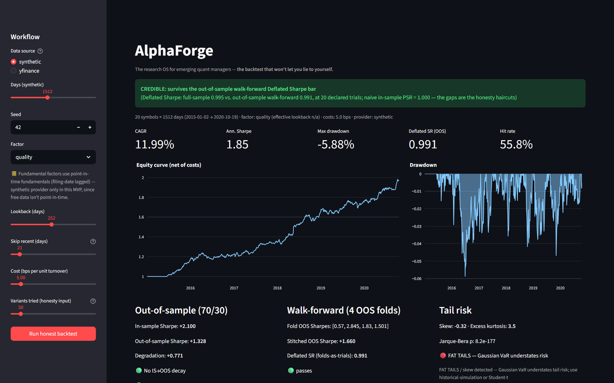

# AlphaForge

[](https://github.com/guilhermeFin/alphaforge/actions/workflows/ci.yml)

> An evidence-first quantitative research workspace for testing ideas without flattering yourself.

AlphaForge takes a research question from data inspection to a reproducible, risk-aware verdict. It is designed for emerging quantitative researchers who care as much about proving an idea wrong as finding one that looks good.



## What AlphaForge Does

| Workspace | What it helps you answer |
| --- | --- |
| **Strategy lab** | Does a factor survive costs, point-in-time controls, and chronological out-of-sample testing? |
| **Data quality** | What data is available, when did it become available, and what can the source honestly support? |
| **Filing research** | What do dated SEC documents and FinBERT-derived text features say, with source links and availability timestamps? |
| **Portfolio lab** | What happens after position limits, turnover, volatility, liquidity, borrow, and execution stress are applied? |
| **Market microstructure lab** | Does signed trade flow beat a simple baseline on a held-out event sample, and how do quote policies behave under explicit assumptions? |
| **Research history** | Can this result be reproduced, audited, exported, and compared later? |

## Built for Research That Can Fail

Most backtests can produce an attractive chart. AlphaForge is built to make the failure modes visible.

- **Point-in-time first:** signals are shifted before trading, filing features use availability dates, and earlier results do not change when later data is removed.
- **The scoring model is point-in-time too:** document studies check whether the model itself existed when the document did, and hold back observations it could not have scored at the time. See [docs/model_time_integrity.md](docs/model_time_integrity.md).
- **Costs are not optional:** turnover costs, spreads, market impact, borrow, participation limits, and partial fills are modeled where the workflow supports them.
- **Out-of-sample is the headline:** walk-forward checks, chronological holdouts, and signal-quality diagnostics sit ahead of full-sample performance.
- **Time gets a second vote:** every Strategy Lab run separates IC evidence into embargoed chronological cohorts and reports whether the observed relationship is stable, weakening, unstable, or too thin to judge. See [docs/temporal_stability.md](docs/temporal_stability.md).
- **Multiple testing is visible:** trial ledgers, Probabilistic Sharpe, Deflated Sharpe, and probability-of-backtest-overfitting diagnostics discount selected winners.
- **Advanced evidence is optional but auditable:** GARCH conditional-risk estimates, SPA/MCS candidate comparisons, point-in-time structural-break checks, and hierarchical risk parity use explicit historical inputs and fail safely when unavailable.
- **Evidence has a status:** synthetic, public, and licensed data are distinguished in the result itself instead of buried in a footnote.
- **A degenerate sample cannot look like a result:** every strategy report and event study carries a data-health read-out — effective observations, non-flat returns, cross-sectional signal dispersion, average active names, and any undefined statistics. A factor whose signal never varies across the universe produces no positions and a flat return series; that is reported as *insufficient variation for a performance claim*, not as a weak result. See [docs/research_validity.md](docs/research_validity.md).
- **Protocols control the actual evaluation window:** a protected validation or final-holdout stage retains earlier history only for signal warm-up, then reports exclusively on its declared chronological range. The final holdout is single-use. See [docs/protocol_execution.md](docs/protocol_execution.md).
- **Benchmarks stay benchmarks:** the fixed Value, Quality, Momentum, and Low-volatility suite uses the same dates and costs without opening a second tuning surface.
- **Limitations stay attached:** a simulated fill remains a simulation; trade-only data is not relabeled as quote-level evidence.

### Model availability vs training-data overlap

A document being available point-in-time does not make its *score* point-in-time. Document studies therefore record two separate facts about the scoring model, and never merge them:

| | Question | If violated |
| --- | --- | --- |
| **Model availability** | Could this model have been run in a live workflow on this date? | The observation is *historically unavailable-model*: nobody could have computed this score at the time, so it cannot support a historically deployable study. Held out of the headline cohort by default. |
| **Training-data overlap** | Is this document's period inside the model's training corpus? | The observation carries *training-data overlap risk*. Reported as a flag; it does not exclude by default. |

**Neither flag proves anything on its own.** Availability is a statement about workflow feasibility, not about the model's behaviour. Overlap means the outcome period *may* be represented in the training data — it is not evidence that the model recalled a specific outcome, and no date comparison can establish memorization. Equally, a cohort that clears both flags has cleared one check only: it says nothing about sample size, multiple testing, cost realism, or whether document tone carries any investment relevance at all.

For FinBERT these are 2020-12-24 (documented, its Hugging Face Hub upload) and 2018-12-31 (inferred, an upper bound). Sources, statuses, configuration, and limitations are in [docs/model_time_integrity.md](docs/model_time_integrity.md).

## Research Workflow

```text
Question
  -> data and availability audit
  -> candidate signal or hypothesis
  -> chronological validation and robustness checks
  -> execution, portfolio, or microstructure stress
  -> evidence verdict, fingerprint, export, and local history
```

The core engine lives in `research/`. The FastAPI service and Streamlit app use the same orchestration path, so the browser view and the local engine produce the same result.

## Market Microstructure Lab

The Market Microstructure Lab is an auditable first step into event-driven research:

- Imports local Binance trade CSVs or runs a deterministic engine check.
- Tests rolling signed trade-flow imbalance against a last-return baseline.
- Reserves chronological training, validation, and final-holdout blocks.
- Reports **trade-price markouts**, not quote-level adverse selection.
- Compares fixed, volatility-aware, and inventory/flow-aware quote policies in an assumption-visible simulation.
- Includes Black-Scholes implied-volatility and delta diagnostics.
- Provides an append-only local BBO recorder for future quote-level studies and a Nasdaq ITCH sample parser for order-event reconstruction.

Read the exact research contract and boundaries in [docs/market_microstructure_lab.md](docs/market_microstructure_lab.md).

## Quick Start

### Local Python setup

```bash
git clone https://github.com/guilhermeFin/alphaforge.git
cd alphaforge
uv sync --locked --extra test
uv run --locked --no-sync pytest
```

AlphaForge's canonical research environment is Python 3.11 plus the committed
`uv.lock`. This keeps a local run and CI on the same resolved dependency graph.
On Windows, the equivalent setup and validation commands are:

```powershell
.\scripts\bootstrap.ps1 -WithTestTools
.\scripts\check.ps1
```

Use `.\scripts\check.ps1 -Coverage` for the local branch-coverage report. Live
data and paid-vendor adapters remain optional and are intentionally outside the
deterministic test environment.

Start the API and workspace in separate terminals:

```bash
uvicorn api.main:app --port 8000
streamlit run app/Home.py
```

- Workspace: `http://localhost:8501`
- API documentation: `http://127.0.0.1:8000/docs`

On Windows, `scripts/run_app.ps1` starts both services.

### Docker Compose

```powershell
# Windows PowerShell
Copy-Item .env.example .env
docker compose up --build
```

```bash
# macOS/Linux
cp .env.example .env
docker compose up --build
```

The application remains local by default. Research history and local data use the `alphaforge-data` Docker volume.

## Optional Connections

AlphaForge works without keys for synthetic demonstrations and selected public-data workflows. Optional connections unlock additional research surfaces.

| Connection | Used for | Required? |
| --- | --- | --- |
| SEC EDGAR user agent | Dated company facts and filings | Optional |
| FRED API key | Macro data with ALFRED vintages | Optional |
| Hugging Face token | FinBERT document classification | Optional |
| Local licensed bundle | Point-in-time prices, fundamentals, and historical-universe inputs | Optional |
| SimFin or Nasdaq Data Link | Additional fundamental-data adapters | Optional |

Copy `.env.example` to `.env` and add only the connections you need. Never commit secrets or vendor data. The local licensed-data contract is documented in [docs/licensed_data_bundle.md](docs/licensed_data_bundle.md).

## Project Structure

```text
research/
  backtest.py              point-in-time-safe historical backtesting
  metrics.py               return, drawdown, tail-risk, PSR, and DSR metrics
  walkforward.py           chronological holdout and walk-forward validation
  overfitting.py           probability of backtest overfitting diagnostics
  signal_quality.py        IC, IC decay, stability, and quantile diagnostics
  execution.py             conservative execution and liquidity stress
  portfolio.py             constrained historical long/short construction
  allocation.py             shrinkage covariance and hierarchical risk parity
  advanced_econometrics.py  optional GARCH, SPA, and Model Confidence Set tests
  regimes.py                point-in-time structural-break diagnostics
  text_features.py         bounded financial-document features and FinBERT support
  filing_sections.py       deterministic MD&A extraction and quality checks
  model_time_integrity.py  scoring-model availability and training-overlap screening
  research_validity.py     data-health checks that block claims on degenerate samples
  temporal_stability.py    embargoed chronological signal-stability cohorts
  protocol_runner.py       date-bounded protocol execution and final-holdout protection
  benchmark_suite.py       fixed reference-factor comparison definitions
  microstructure/          trade-flow research, quote recorder, and ITCH parser
  reproducibility.py       stable data and research fingerprints

api/
  service.py               shared research orchestration
  main.py                  FastAPI endpoints

app/
  Home.py                  Strategy Lab
  pages/                   Data, filing, portfolio, connection, history, and microstructure workspaces

tests/                     engine, API contract, and Streamlit AppTest coverage
  research_fixtures.py     deterministic realistic and degenerate research bundles
docs/                      data contracts, research boundaries, and references
```

## Data and Claim Boundaries

AlphaForge is intentionally conservative about what its data can establish.

- Synthetic results validate software behavior, never an investment edge.
- Free current-ticker price history can be survivorship-biased and may omit delisted companies.
- Filing-date data can be point-in-time without providing a historical, survivorship-free universe.
- A document being available point-in-time does not make its *score* point-in-time. FinBERT weights reached the Hugging Face Hub on 2020-12-24, so a score on an earlier filing is a historically unavailable-model observation and cannot support a historically deployable study.
- Local trade data does not establish order-book depth, queue position, or realized limit-order fills.
- Indicative or delayed options data supports mathematical diagnostics, not execution-quality options research.
- Backtests and simulations are hypothetical and do not place orders or recommend investments.
- A real-market claim requires a licensed bundle with corporate-action-adjusted prices, historical membership, delisted securities, and as-reported fundamentals. The completion checklist is in [docs/protocol_execution.md](docs/protocol_execution.md).

## Testing

```bash
uv sync --locked --extra test
uv run --locked --no-sync pytest
```

The suite covers research invariants, API contracts, data validation, reproducibility, execution stress, and the Streamlit workflows. Every exported strategy manifest records a lockfile digest, Python runtime, selected package versions, and Git state alongside its data fingerprints. AlphaForge treats a failing integrity check as a product feature: a result that cannot be supported should not be promoted.

## Contributing

The standard is simple: new research features must make their data assumptions, timing rules, baselines, and limitations explicit. A result should be easier to audit after a feature is added, never harder.

## Disclaimer

AlphaForge is research software, not investment advice. Backtests and simulations are hypothetical, may omit real-world frictions, and do not predict future results.
